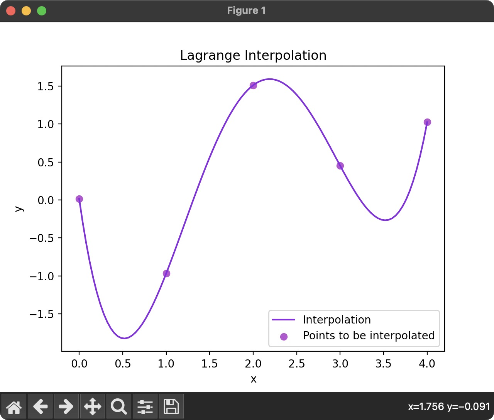

# Lagrange-Interpolation

## Introduction

This module implements two functions, both of which interpolates a set of points in $ℝ^2$ using the Lagrange method. One of the functions uses traditional for loops while the other uses NumPy methods and functions. I created this module primarily to practise using vector operations in NumPy and to test the maximum speed improvement that could be achieved.

## Installation

Python 3.10

### Required External Libraries

* numpy 1.22.3
* matplotlib 3.6.2

## Features

The time_comparison.py file runs each interpolation function N (default == 5000) times and calculates various metrics detailing the average improvement of the NumPy implementation over the for loop implementation.

The `plot_lagrange_interpolation` function plots the result of the interpolation.

